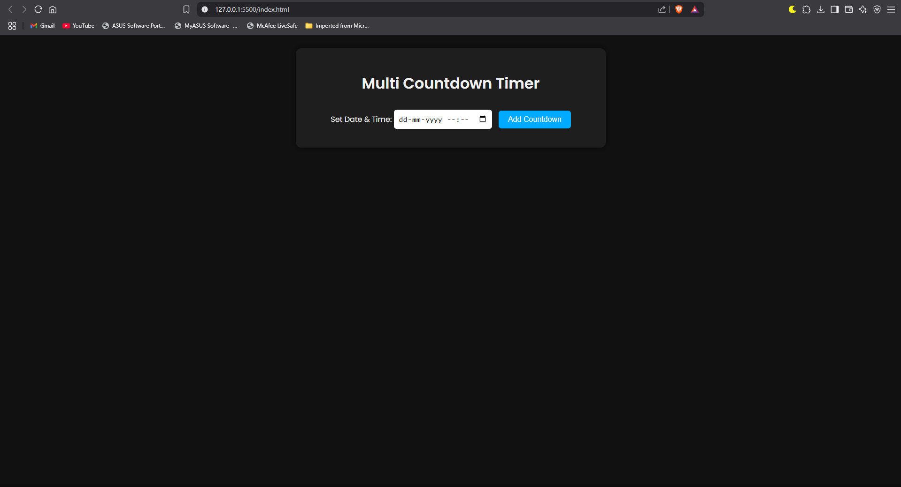
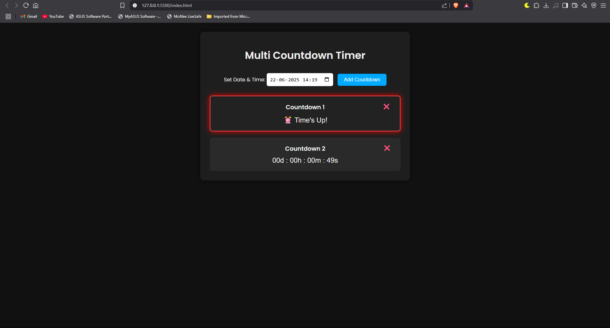

# Multi Countdown Timer:
A simple, elegant web application that allows you to create multiple countdown timers to any future date and time. Each timer counts down in days, hours, minutes, and seconds, with a delete option and an alert sound when the timer hits zero.

## Features:
- Set multiple countdowns on the same page
- Displays remaining time in days, hours, minutes, and seconds
- Deletes timers individually
- Plays an alert sound when a timer finishes
- Saves timers in browser’s localStorage to persist after page reload
- Clean, modern UI with Google Fonts and subtle animations

## Screenshots: 

## How to Use: 

### Setup
- Download the project files or clone the repository.

- Make sure you have these files:
`index.html`
`style.css`
`script.js`
`alarm.mp3 (alert sound file)`

- Open `index.html` in any modern web browser (Chrome, Firefox, Edge, Safari).

### Creating a Countdown:
- Use the Date & Time input field to pick a future date and time for your countdown.
- Click the "Add Countdown" button to create the timer.
- Your new countdown will appear below the input, showing the remaining time updating every second.

### Managing Timers: 
- Each countdown timer has a delete (❌) button on the top-right corner. Click it to remove that timer.
- When a timer reaches zero, the timer text changes to "⏰ Time's Up!" and a sound alert plays.
- All timers are saved in your browser, so if you refresh or close the page and come back later, your timers will still be there.

### Important Notes:
- The timer won't accept past dates — it will prompt you to select a valid future time.
- The alert sound requires the file alarm.mp3 to be in the project folder; you can replace it with any sound you like, but keep the filename consistent or update the HTML accordingly.
- This project uses modern JavaScript features and may not work on very old browsers.

## Technologies Used: 
- HTML5
- CSS3 (with Google Fonts)
- JavaScript (ES6)
- LocalStorage for data persistence

## License:
Feel free to use, modify, and distribute this project as you like.
